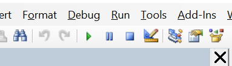

# gradesheets-maker
A smol repo for making gradesheets and then converting the finished ones to pdfs. This should preserve any formulas that you have in your templates.

Feel free to use this how you like but do expect issues down the line. Either fix them yourself (and contribute to this repo) or let me know and I can work on a fix.

This is run using VBA. It has been made on Windows but I can't see why it won't run on mac.

### Maybe save the files in the tutorial folder and have a go before you use actual students names etc.

## Before you start

- Enable developer mode on Excel [(File, Options, Customize the Ribbon, tick Developer)](https://support.microsoft.com/en-us/office/show-the-developer-tab-e1192344-5e56-4d45-931b-e5fd9bea2d45)

- Download the gradesheet_and_pdf_maker.xlsm file from the files above, save it and open if
- Enable macro content
- Click on the Developer tab then Visual Basic which opens a new window
- Double click the gradesheetmaker module and then go the the README in the gradesheetmaker folder

## How to use the gradesheetmaker module

### Prerequesites 

- Your template gradesheet with all of the details that don't change filled out
- An excel file with student names, IDs and any other details that change
- Close all other excel files

## Start

- You will need to edit the code in the editor that should be open on your screen.

- Change the path of the template to the correct location on your device (line 17; tip: go to the file explorer and navigate to where the template is saved, right click the address bar at the top click copy address as text). Make sure there is a backslash at the end.

- Do the same for the list of students and the destination file path (Lines 21 and 24)

- Make sure the students' names and IDs are being picked from the right column (lines 40-41; the file is currently configured for the supplied template and students list in the tutorial folder). Add any extra columns in if needed. Column A is `wsData.Cells(i, 1)` column B is `wsData.Cells(i, 2)` etc.

- Select the correct cells to put the details into (Lines 45-6). Make sure the variables match the names given above if any have been added.

- Set the pattern for the student file (Line 56). You may have to configure your list of students if you want to do _surname firstname_ for example.

## How to use the pdfmaker module

### Prerequesites 

- Your completed gradesheets as xlsx files all in one folder
- Close all other excel files

## Start

- You will need to edit the code in the editor that should be open on your screen.

- Change the path of the file with the completed gradesheets to the correct location on your device (line 15; tip: go to the file explorer and navigate to where the template is saved, right click the address bar at the top click copy address as text). Make sure there is a backslash at the end.

- Line 37 is currently set that it output the pdfs to the folder that the excel files are in. If you want a different one, comment out (with a ') line 37 and uncomment (by deleting the ') and edit line 39. Also Change line 42 to `FilePath2`

### How to import new files
- Save the two .bas files to your machine
- Open a blank Excel file and save (anywhere) as a .xlsm (macro enabled) file
- Click on the Developer tab then Visual Basic which opens a new window

 

- Choose import and pick each of the two .bas files (need to do this twice)

- Once you have imported the modules and saved the blank file, you should be able to reopen it with any changes to the modules already saved.

- If you want to share the module if you have made changes, right click it on the left and press export. 

