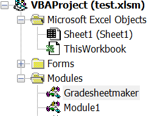
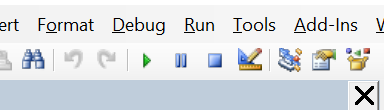

# How to use the gradesheetmaker module

## Prerequesites 

- Your template gradesheet with all of the details that don't change filled out
- An excel file with student names, IDs and any other details that change
- Close all other excel files

## Start

- You will need to edit the code in the editor that should be open on your screen.

- Change the path of the template to the correct location on your device (line 17; tip: go to the file explorer and navigate to where the template is saved, right click the address bar at the top click copy address as text). Make sure there is a backslash at the end.

- Do the same for the list of students and the destination file path (Lines 21 and 24)

- Make sure the students' names and IDs are being picked from the right column (lines 40-41; the file is currently configured for the supplied template and students list in the tutorial folder). Add any extra columns in if needed. Column A is `wsData.Cells(i, 1)` column B is `wsData.Cells(i, 2)` etc.

- Select the correct cells to put the details into (Lines 45-6). Make sure the variables match the names given above if any have been added.

- Set the pattern for the student file (Line 56). You may have to configure your list of students if you want to do _surname firstname_ for example.

